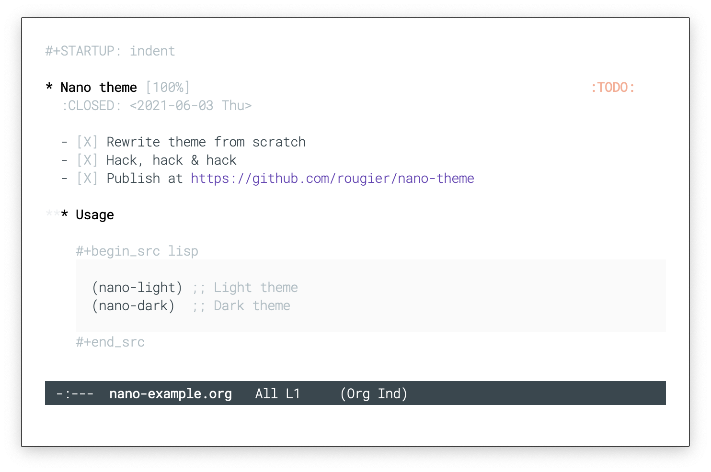
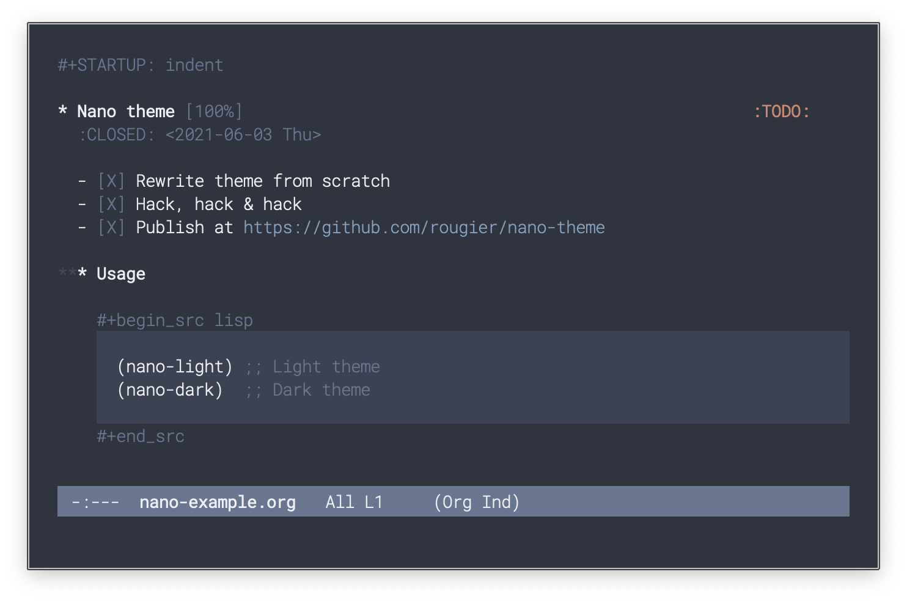
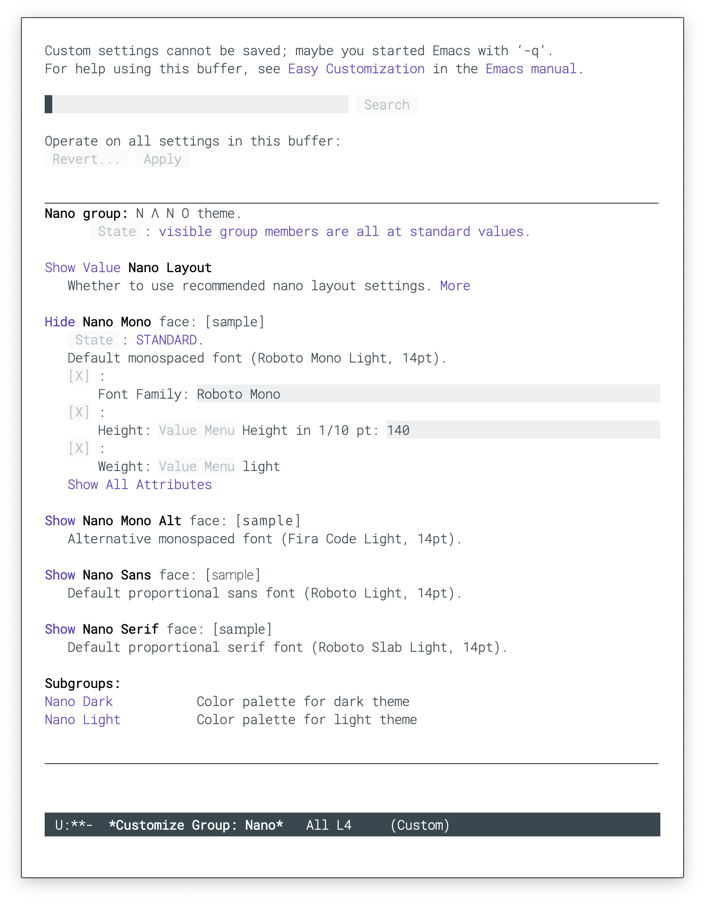
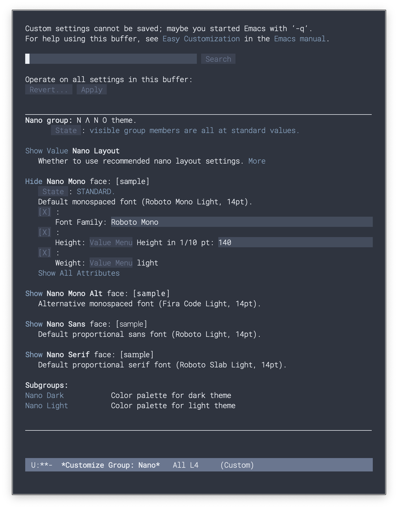
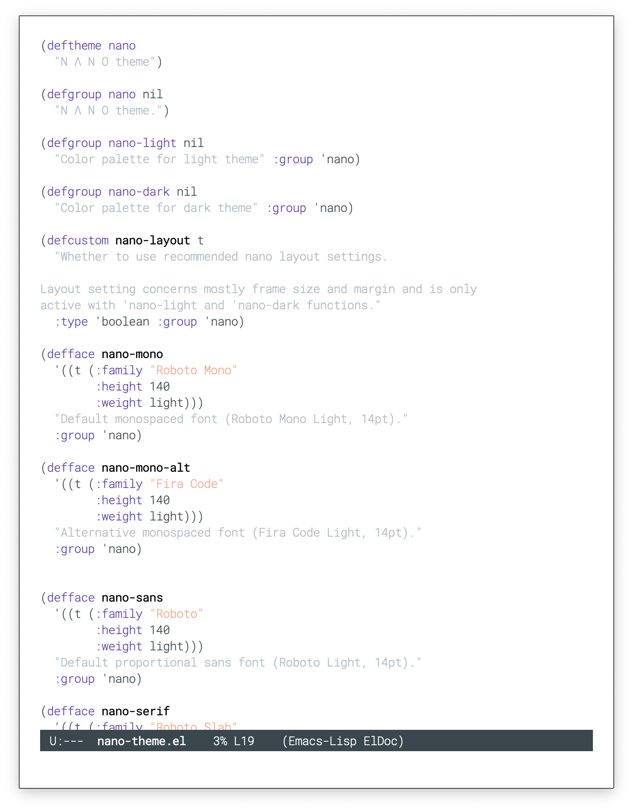
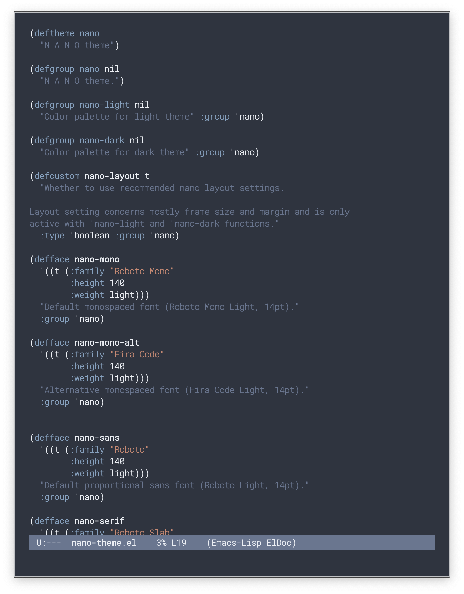

## GNU Emacs / N Λ N O Theme 

A consistent theme for GNU Emacs. The light theme is based on [Material
colors](https://material.io/) and the dark theme is based on [Nord
colors](https://www.nordtheme.com/).

The theme is based on a set of six faces (only):

- **Critical face** is for information that requires immediate action.

  > It should be of high constrast when compared to other faces. This
  > can be realized (for example) by setting an intense background
  > color, typically a shade of red. It must be used scarcely.

- **Popout face** is used for information that needs attention.

  > To achieve such effect, the hue of the face has to be sufficiently
  > different from other faces such that it attracts attention through
  > the popout effect.

- **Strong face** is used for information of a structural nature.

  > It has to be the same color as the default color and only the
  > weight differs by one level (e.g., light/regular or
  > regular/bold). IT is generally used for titles, keywords,
  > directory, etc.

- **Salient face** is used for information that are important.

  > To suggest the information is of the same nature but important,
  > the face uses a different hue with approximately the same
  > intensity as the default face. This is typically used for links.

- **Faded face** is for information that are less important.

  > It is made by using the same hue as the default but with a lesser
  > intensity than the default. It can be used for comments, secondary
  > information and also replace italic (which is generally abused
  > anyway

- **Subtle face** is used to suggest a physical area on the screen.

  > It is important to not disturb too strongly the reading of
  > information and this can be made by setting a very light
  > background color that is barely perceptible.

### Usage

You can save the file in you `.emacs.d` directory and then type `M-x:
(load-theme 'nano)` or `M-x: (nano-light)` or `M-x: (nano-dark)`

### Screenshots

