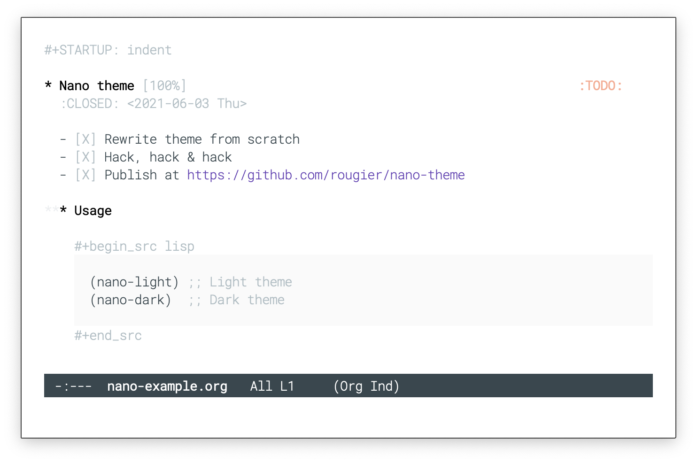
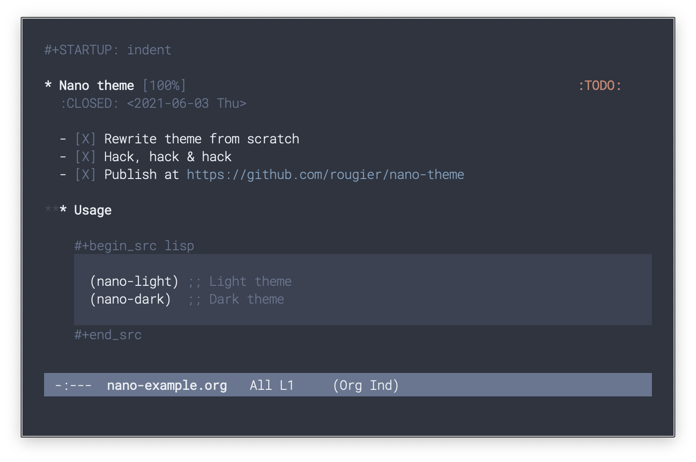
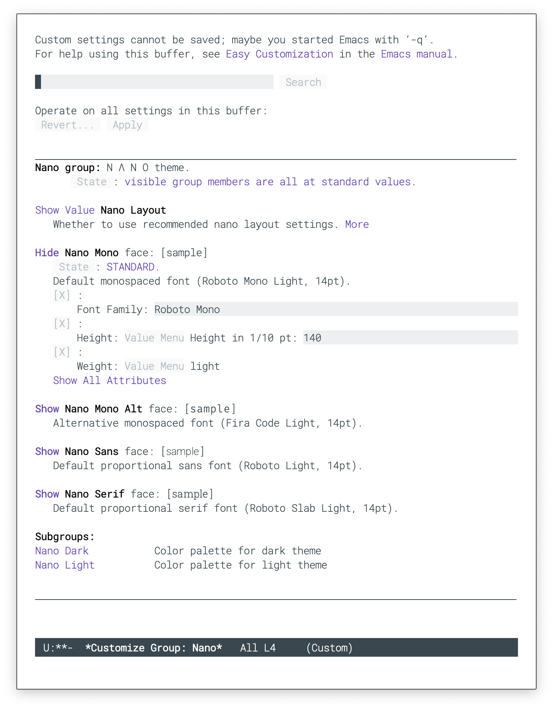
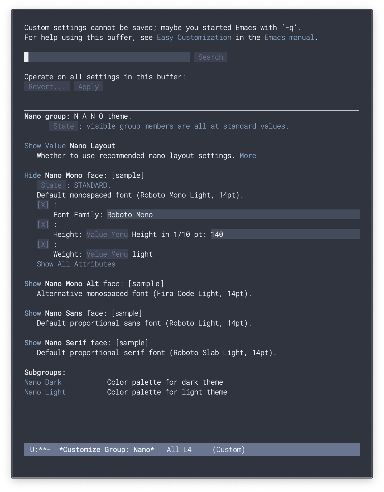
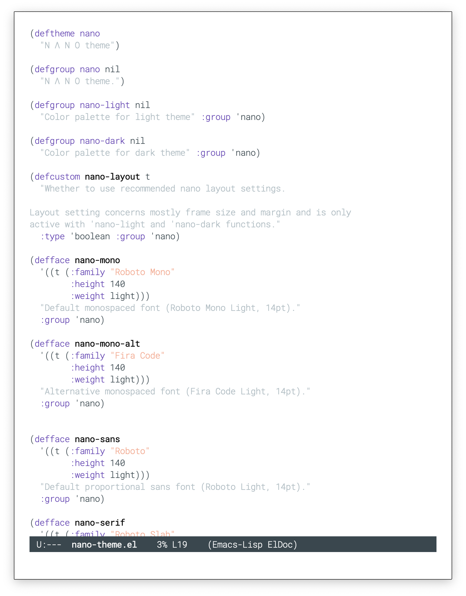
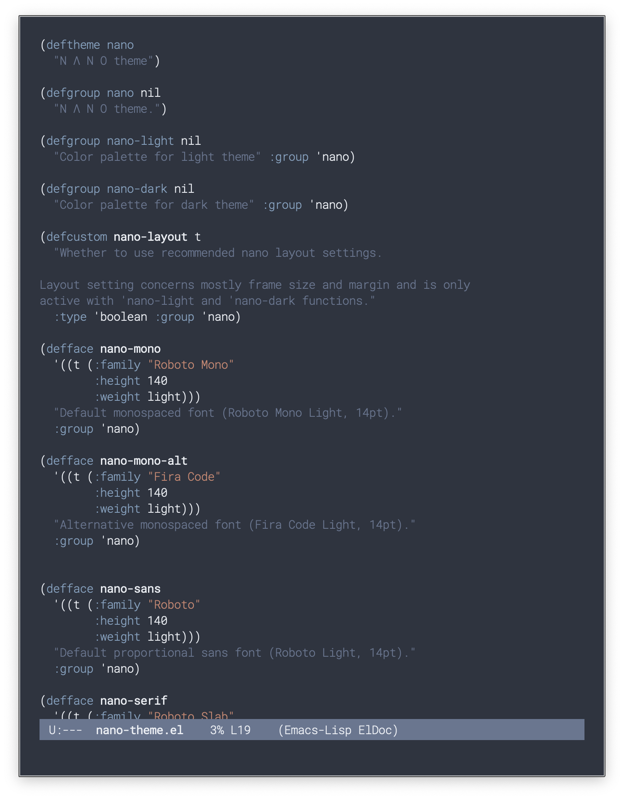

## GNU Emacs / NANO Theme 

A consistent theme for GNU Emacs. The light anf gray themes are based
on [Material colors](https://material.io/), the dark theme is based
on [Nord colors](https://www.nordtheme.com/) and the monochrome theme
comes with two shades of gray.

The theme is based on a set of seven faces (and their variants):

- **Critical face** is for information that requires immediate action.

  > It should be of high constrast when compared to other faces. This
  > can be realized (for example) by setting an intense background
  > color, typically a shade of red. It must be used scarcely.

- **Popout face** is used for information that needs attention.

  > To achieve such effect, the hue of the face has to be sufficiently
  > different from other faces such that it attracts attention through
  > the popout effect.

- **Strong face** is used for information of a structural nature.

  > It has to be the same color as the default color and only the
  > weight differs by one level (e.g., light/regular or
  > regular/bold). IT is generally used for titles, keywords,
  > directory, etc.

- **Salient face** is used for information that are important.

  > To suggest the information is of the same nature but important,
  > the face uses a different hue with approximately the same
  > intensity as the default face. This is typically used for links.

- **Faded face** is for information that are less important.

  > It is made by using the same hue as the default but with a lesser
  > intensity than the default. It can be used for comments, secondary
  > information and also replace italic (which is generally abused
  > anyway

- **Subtle face** is used to suggest a physical area on the screen.

  > It is important to not disturb too strongly the reading of
  > information and this can be made by setting a very light
  > background color.
  
- **Higlight face** is used to highlight a physical area on the screen.

  > Highlight is mostly used to transiently highlight a region by
  > setting a very light background color that is barely
  > perceptible.
 

### Installation

Install direclty from ELPA repository:

```
(package-install 'nano-theme)
```

### Usage

Load theme directly via `M-x: (load-theme 'nano-light t)`  
(other themes are nano-gray, nano-dark and nano-mono)

### Screenshots

<div>


</div>

<div>


</div>

<div>


</div>
